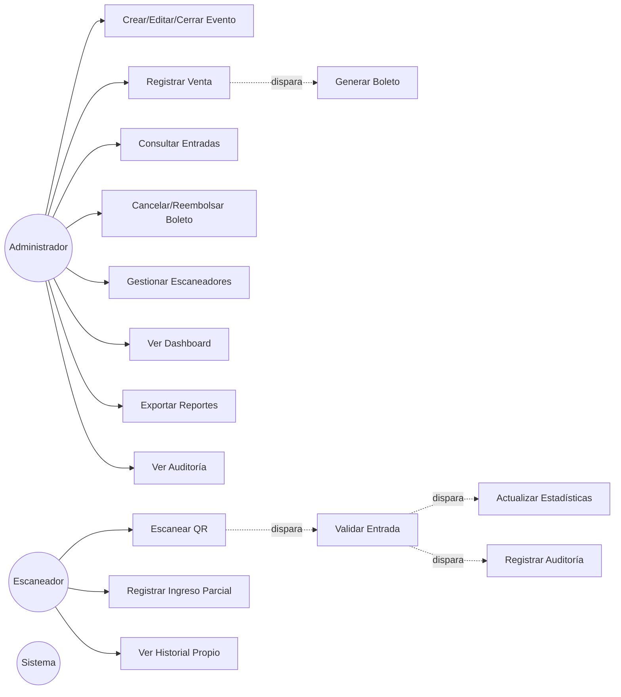

# Casos de Uso

## Actores

- **Administrador** — acceso completo.
- **Escaneador** — acceso limitado a validación de entradas e historial propio.
- **Sistema** — procesos automáticos (generación de boleto, estadísticas).

## Administrador

| ID | Caso de uso | Descripción |
|---|---|---|
| UC-01 | Iniciar sesión | Login con email/contraseña, recibe JWT |
| UC-02 | Crear evento | Define nombre, fecha, lugar, logo, configuración de precios |
| UC-03 | Editar evento | Modifica datos de un evento existente |
| UC-04 | Cerrar evento | Cambia estado del evento a "cerrado"; bloquea nuevas ventas |
| UC-05 | Duplicar configuración entre eventos | Copia configuración (precios, plantillas) de un evento a otro nuevo |
| UC-06 | Registrar venta | Captura comprador, email opcional, cantidad de personas, evento; dispara UC-12 |
| UC-07 | Consultar entradas | Filtra por evento/estado (vendidas, utilizadas, pendientes, canceladas, duplicadas) |
| UC-08 | Ver historial de escaneos | Lista de escaneos por boleto/evento/escaneador |
| UC-09 | Reenviar boleto PDF | Reenvía copia del PDF generado (email o descarga) |
| UC-10 | Descargar/reimprimir boleto | Descarga el PDF almacenado |
| UC-11 | Cancelar boleto | Cambia estado a "Cancelado"; ya no es válido para ingreso |
| UC-12 | Reembolsar boleto | Cambia estado a "Reembolsado" |
| UC-13 | Bloquear boleto por fraude | Cambia estado a "Bloqueado por fraude" tras detección de duplicado/anomalía |
| UC-14 | Crear escaneador | Crea usuario con rol Escaneador |
| UC-15 | Editar escaneador | Modifica datos del escaneador |
| UC-16 | Desactivar escaneador | Inhabilita acceso sin eliminar historial |
| UC-17 | Restablecer contraseña de escaneador | Genera nueva contraseña temporal |
| UC-18 | Consultar actividad de escaneador | Ver boletos validados, tiempos, tasa de actividad |
| UC-19 | Ver dashboard | Estadísticas agregadas, filtrable por evento |
| UC-20 | Exportar reportes | Genera archivo Excel/CSV/PDF de ventas/boletos/escaneos |
| UC-21 | Consultar bitácora de auditoría | Ver historial de acciones de todos los usuarios |
| UC-22 | Configurar precios del evento | Define precio base y reglas por evento |
| UC-23 | Importar/exportar datos masivos | Carga o exporta ventas/boletos en lote |

## Escaneador

| ID | Caso de uso | Descripción |
|---|---|---|
| UC-24 | Iniciar sesión | Login con credenciales asignadas por admin |
| UC-25 | Escanear QR | Usa cámara (móvil o web) para leer el código |
| UC-26 | Validar entrada | Sistema responde en <1s: válida / ya utilizada / inválida |
| UC-27 | Registrar ingreso parcial | Si el boleto tiene N personas, registra cuántas ingresan en este escaneo, hasta completar el total |
| UC-28 | Consultar historial personal | Ve únicamente las entradas que él mismo registró |

## Sistema (automático)

| ID | Caso de uso | Disparador | Acción |
|---|---|---|---|
| UC-29 | Generar boleto | Al guardar una venta (UC-06) | Crea folio único, UUID, token de validación, PDF con QR embebido, guarda copia en Blob Storage |
| UC-30 | Actualizar estadísticas | Cada venta o escaneo | Recalcula contadores de dashboard (ventas, ingresos, asistencia) |
| UC-31 | Detectar boleto duplicado/fraude | Al escanear un boleto ya "Utilizado" o con token inválido reutilizado | Marca el intento en bitácora, puede sugerir bloqueo por fraude |
| UC-32 | Registrar en bitácora de auditoría | Cualquier mutación (crear/editar/cancelar/escanear) | Inserta registro con usuario, acción, entidad, timestamp, IP |

## Diagrama de casos de uso (resumen)

