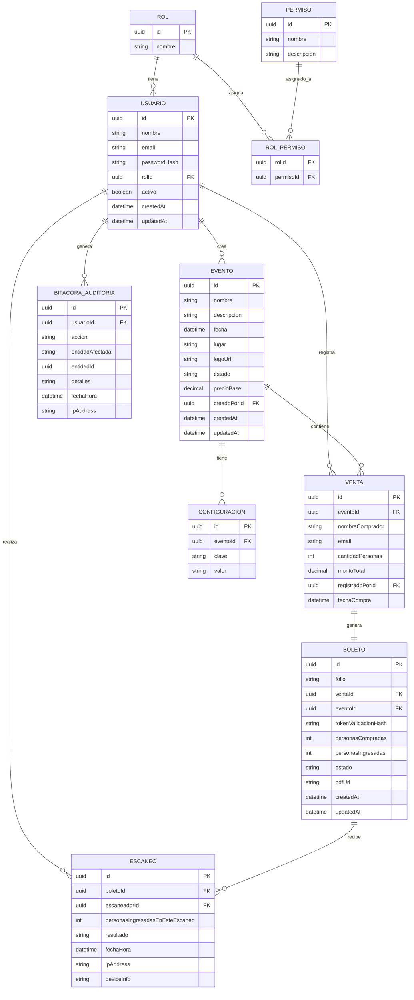

# Modelo de Datos

## 1. Diagrama Entidad-Relación

## 2. Especificación de tablas

### Rol
| Campo | Tipo | Restricciones |
|---|---|---|
| id | UUID | PK |
| nombre | varchar(50) | UNIQUE, NOT NULL (`admin`, `escaneador`) |

### Permiso
| Campo | Tipo | Restricciones |
|---|---|---|
| id | UUID | PK |
| nombre | varchar(100) | UNIQUE, NOT NULL |
| descripcion | varchar(255) | NULL |

### RolPermiso (tabla puente N:M)
| Campo | Tipo | Restricciones |
|---|---|---|
| rolId | UUID | PK compuesta, FK → Rol.id |
| permisoId | UUID | PK compuesta, FK → Permiso.id |

### Usuario
| Campo | Tipo | Restricciones |
|---|---|---|
| id | UUID | PK |
| nombre | varchar(150) | NOT NULL |
| email | varchar(255) | UNIQUE, NOT NULL |
| passwordHash | varchar(255) | NOT NULL (bcrypt) |
| rolId | UUID | FK → Rol.id, NOT NULL |
| activo | bit | NOT NULL, default 1 |
| createdAt / updatedAt | datetime2 | NOT NULL |

Índices: `IX_Usuario_email` (unique), `IX_Usuario_rolId`.

### Evento
| Campo | Tipo | Restricciones |
|---|---|---|
| id | UUID | PK |
| nombre | varchar(150) | NOT NULL |
| descripcion | varchar(1000) | NULL |
| fecha | datetime2 | NOT NULL |
| lugar | varchar(255) | NULL |
| logoUrl | varchar(500) | NULL |
| estado | varchar(20) | NOT NULL, CHECK IN ('activo','cerrado') |
| precioBase | decimal(10,2) | NULL |
| creadoPorId | UUID | FK → Usuario.id |
| createdAt / updatedAt | datetime2 | NOT NULL |

Índices: `IX_Evento_estado`.

### Venta
| Campo | Tipo | Restricciones |
|---|---|---|
| id | UUID | PK |
| eventoId | UUID | FK → Evento.id, NOT NULL |
| nombreComprador | varchar(150) | NOT NULL |
| email | varchar(255) | NULL |
| cantidadPersonas | int | NOT NULL, CHECK > 0 |
| montoTotal | decimal(10,2) | NULL |
| registradoPorId | UUID | FK → Usuario.id (admin), NOT NULL |
| fechaCompra | datetime2 | NOT NULL, default `now()` |

Índices: `IX_Venta_eventoId`, `IX_Venta_fechaCompra`.

### Boleto
| Campo | Tipo | Restricciones |
|---|---|---|
| id | UUID | PK |
| folio | varchar(30) | UNIQUE, NOT NULL (ej. `RV2025-001`) |
| ventaId | UUID | FK → Venta.id, UNIQUE, NOT NULL (1:1) |
| eventoId | UUID | FK → Evento.id, NOT NULL (denormalizado para consultas) |
| tokenValidacionHash | varchar(255) | UNIQUE, NOT NULL (hash del token incluido en el QR) |
| personasCompradas | int | NOT NULL, CHECK > 0 |
| personasIngresadas | int | NOT NULL, default 0, CHECK >= 0 |
| estado | varchar(30) | NOT NULL, CHECK IN ('Pendiente','ParcialmenteUtilizado','Utilizado','Cancelado','Reembolsado','BloqueadoPorFraude') |
| pdfUrl | varchar(500) | NULL (ruta en Azure Blob Storage) |
| createdAt / updatedAt | datetime2 | NOT NULL |

Restricción adicional: `personasIngresadas <= personasCompradas` (CHECK o validación en aplicación).

Índices: `IX_Boleto_folio` (unique), `IX_Boleto_tokenValidacionHash` (unique), `IX_Boleto_eventoId`, `IX_Boleto_estado`.

### Escaneo
| Campo | Tipo | Restricciones |
|---|---|---|
| id | UUID | PK |
| boletoId | UUID | FK → Boleto.id, NOT NULL |
| escaneadorId | UUID | FK → Usuario.id, NOT NULL |
| personasIngresadasEnEsteEscaneo | int | NOT NULL, CHECK > 0 |
| resultado | varchar(30) | NOT NULL, CHECK IN ('Valido','YaUtilizado','Invalido','Fraude') |
| fechaHora | datetime2 | NOT NULL, default `now()` |
| ipAddress | varchar(45) | NULL |
| deviceInfo | varchar(255) | NULL |

Índices: `IX_Escaneo_boletoId`, `IX_Escaneo_escaneadorId`, `IX_Escaneo_fechaHora`.

### Configuracion
| Campo | Tipo | Restricciones |
|---|---|---|
| id | UUID | PK |
| eventoId | UUID | FK → Evento.id, NULL (NULL = configuración global) |
| clave | varchar(100) | NOT NULL |
| valor | varchar(1000) | NULL |

Índices: `UQ_Configuracion_eventoId_clave` (unique compuesto).

### BitacoraAuditoria
| Campo | Tipo | Restricciones |
|---|---|---|
| id | UUID | PK |
| usuarioId | UUID | FK → Usuario.id, NULL (NULL = acción de sistema) |
| accion | varchar(100) | NOT NULL (ej. `VENTA_CREADA`, `BOLETO_ESCANEADO`) |
| entidadAfectada | varchar(50) | NOT NULL |
| entidadId | UUID | NULL |
| detalles | nvarchar(max) | NULL (JSON) |
| fechaHora | datetime2 | NOT NULL, default `now()` |
| ipAddress | varchar(45) | NULL |

Índices: `IX_Bitacora_entidadAfectada_entidadId`, `IX_Bitacora_fechaHora`.

## 3. Reglas de integridad relevantes

1. Un boleto pertenece exactamente a una venta y a un evento (consistencia garantizada por trigger/transacción: `boleto.eventoId == venta.eventoId`).
2. `personasIngresadas` solo se incrementa mediante transacción atómica en `ScansModule` (evita condiciones de carrera en escaneos concurrentes).
3. El estado del boleto se deriva: `Pendiente` (0 ingresos) → `ParcialmenteUtilizado` (0 < ingresadas < compradas) → `Utilizado` (ingresadas == compradas). `Cancelado`, `Reembolsado` y `BloqueadoPorFraude` son terminales y excluyentes de incremento de ingresos.
4. El QR contiene únicamente `{ uuid: boleto.id, token: <token en claro> }`; el backend solo almacena `tokenValidacionHash` (hash, no reversible) y compara hash en validación.
