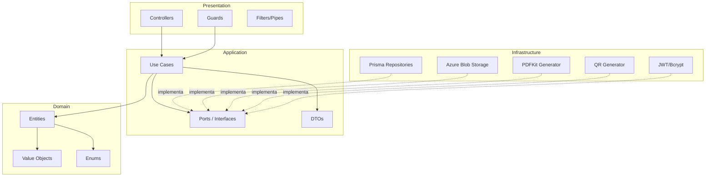
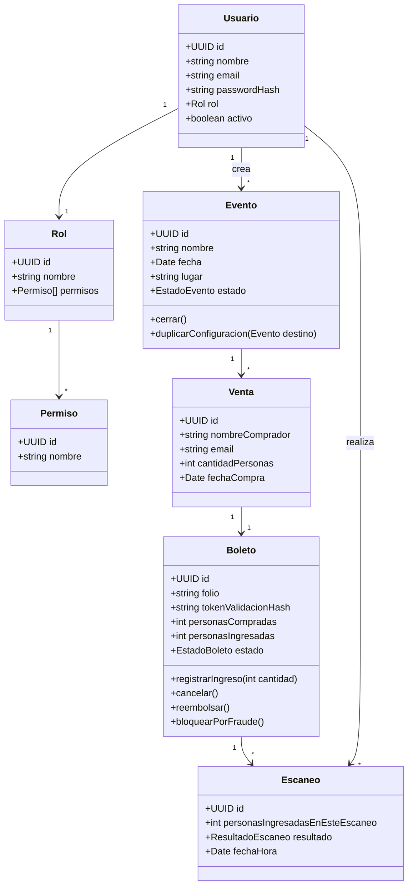
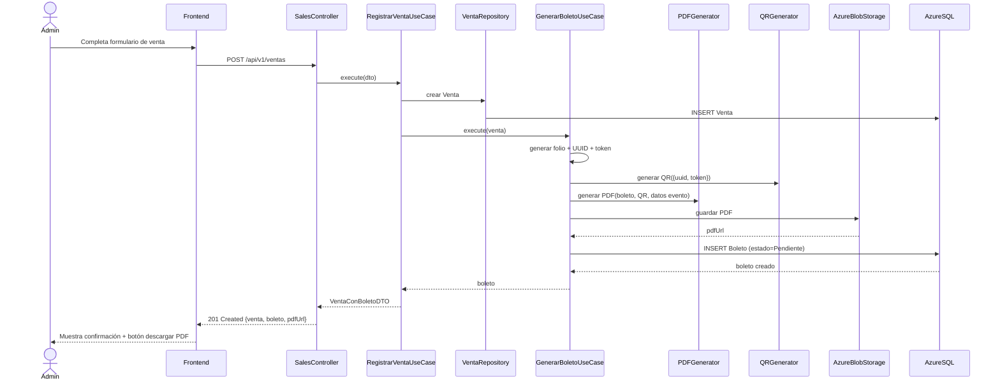
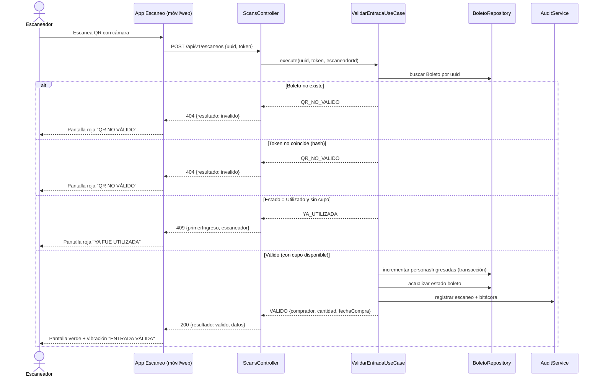
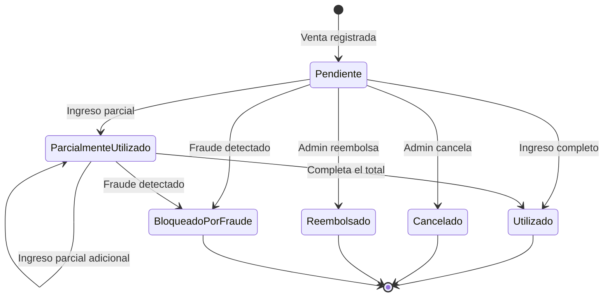

# Diagramas UML

## 1. Diagrama de componentes (Clean Architecture)

## 2. Diagrama de clases (dominio simplificado)

## 3. Diagrama de secuencia — Registrar venta y generar boleto (UC-06 → UC-29)

## 4. Diagrama de secuencia — Escanear y validar QR (UC-25 → UC-27)

## 5. Diagrama de estados — Boleto

